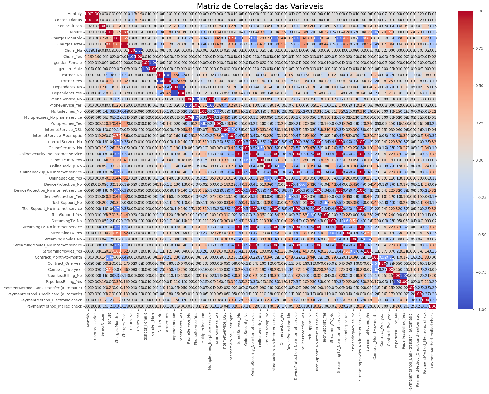
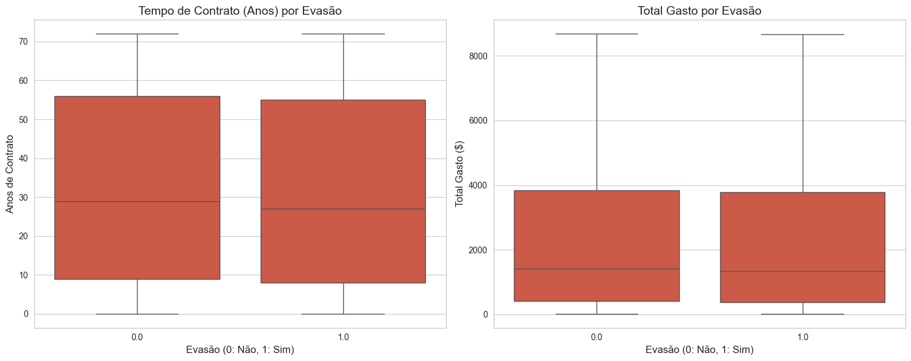
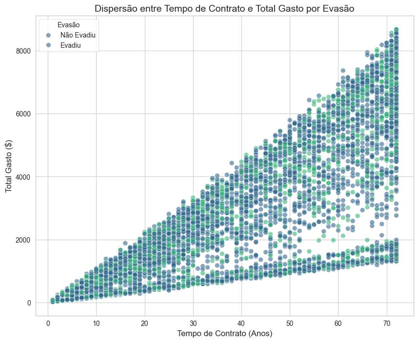
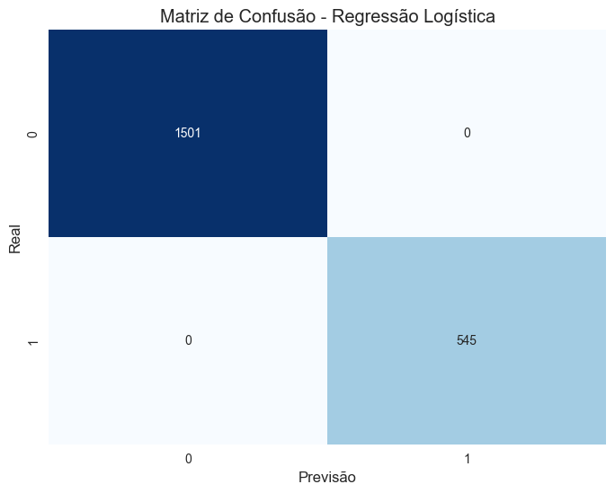

# RELATÓRIO FINAL - parte 2

# Introdução
## Propósito da análise


## Estrutura do projeto e organização dos arquivos
O projeto se encontra no seguinte link no Github:  https://github.com/thauanqs/DESAFIO_TELECOMX

## Instruções para executar o notebook

Os requisitos estão listados em "requirements.txt" e podem ser instalados usando o comando: \
```
py -m pip install -r requirements.txt
```


# Execução do trabalho
A seguir se dá como foi realizado o desenvolvimento do projeto.

## Encoding

    Transforme as variáveis categóricas em formato numérico para torná-las compatíveis com algoritmos de machine learning. Utilize um método de codificação adequado, como o one-hot encoding.

```
import pandas as pd
from sklearn.preprocessing import OneHotEncoder

# Carregue o DataFrame 'dados_tratados.csv'
# Suponha que o arquivo já foi salvo e contém as colunas limpas.
df = pd.read_csv('dados_tratados.csv')

# Identifique as colunas categóricas a serem codificadas
colunas_categoricas = [
    'Churn', 'gender', 'Partner', 'Dependents', 'PhoneService',
    'MultipleLines', 'InternetService', 'OnlineSecurity', 'OnlineBackup',
    'DeviceProtection', 'TechSupport', 'StreamingTV', 'StreamingMovies',
    'Contract', 'PaperlessBilling', 'PaymentMethod'
]

# Inicialize o OneHotEncoder
# 'sparse_output=False' garante que a saída será um array denso (não esparso)
ohe = OneHotEncoder(sparse_output=False)

# Aplique a codificação one-hot nas colunas categóricas
df_encoded_cols = ohe.fit_transform(df[colunas_categoricas])

# Crie um DataFrame com as novas colunas codificadas
# 'ohe.get_feature_names_out()' cria os nomes das colunas de forma automática
df_encoded = pd.DataFrame(df_encoded_cols, columns=ohe.get_feature_names_out(colunas_categoricas))

# Junte o novo DataFrame codificado com as colunas numéricas originais
# 'axis=1' garante que a concatenação seja feita lado a lado
df_final = pd.concat([df.drop(columns=colunas_categoricas), df_encoded], axis=1)

# Verifique o resultado final do DataFrame
print(df_final.info())
print("\nPrimeiras 5 linhas do DataFrame codificado:")
print(df_final.head())
```


## Verificação da Proporção de Evasão

    Calcule a proporção de clientes que evadiram em relação aos que permaneceram ativos. Avalie se há desequilíbrio entre as classes, o que pode impactar modelos preditivos e a análise de resultados.


Execução:
```
import pandas as pd

# Carregue o DataFrame final que foi salvo após a codificação
df = pd.read_csv('df_final.csv')

# Calcule a contagem de cada classe na coluna 'Churn_Yes'
# 1 = Clientes que evadiram (Yes)
# 0 = Clientes que permaneceram (No)
contagem_classes = df['Churn_Yes'].value_counts()

# Calcule a proporção de cada classe em porcentagem
proporcao_classes = df['Churn_Yes'].value_counts(normalize=True) * 100

print("Contagem de clientes por classe:")
print(contagem_classes)
print("\nProporção de clientes por classe (%):")
print(proporcao_classes)

# Salvar a contagem e a proporção para referência futura (opcional)
contagem_classes.to_csv('contagem_classes.csv')
proporcao_classes.to_csv('proporcao_classes.csv')

```
Obtemos o retorno:
```
Contagem de clientes por classe:
Churn_Yes
0.0    5009
1.0    1821
Name: count, dtype: int64

Proporção de clientes por classe (%):
Churn_Yes
0.0    73.338214
1.0    26.661786
Name: proportion, dtype: float64

```
## Correlação e seleção de variáveis

    Visualize a matriz de correlação para identificar relações entre variáveis numéricas. Observe especialmente quais variáveis apresentam maior correlação com a evasão, pois elas podem ser fortes candidatas para o modelo preditivo.


Execução:
```

import pandas as pd
import seaborn as sns
import matplotlib.pyplot as plt

# Carregue o DataFrame final que contém as variáveis numéricas
df = pd.read_csv('df_final.csv')

# Calcule a matriz de correlação do DataFrame
correlation_matrix = df.corr()

# Configure o estilo e o tamanho do gráfico
plt.style.use('ggplot')
plt.figure(figsize=(20, 15))

# Crie o mapa de calor (heatmap)
sns.heatmap(
    correlation_matrix,
    annot=True,        # Mostra os valores de correlação no mapa
    cmap='coolwarm',   # Define o esquema de cores
    fmt=".2f",         # Formata os valores com 2 casas decimais
    linewidths=.5,     # Adiciona linhas entre as células
    vmin=-1,           # Garante que a escala de cor vá de -1 a 1
    vmax=1
)

# Adicione um título ao gráfico
plt.title('Matriz de Correlação das Variáveis', fontsize=20)

# Rotacione os rótulos do eixo x para melhor visualização
plt.xticks(rotation=90)
plt.yticks(rotation=0)

# Garanta que o layout da figura se ajuste bem
plt.tight_layout()

# Exiba o gráfico
plt.show()

# Opcionalmente, salve a figura em um arquivo
# plt.savefig('matriz_de_correlacao.png')

```
Resultados:



## Análises Direcionadas

    Investigue como variáveis específicas se relacionam com a evasão, como:
    Tempo de contrato × Evasão
    Total gasto × Evasão
    Utilize gráficos como boxplots ou dispersão (scatter plots) para visualizar padrões e possíveis tendências.


Execução:
```
import pandas as pd
import seaborn as sns
import matplotlib.pyplot as plt

# Carregue o DataFrame final com as variáveis numéricas e codificadas
df = pd.read_csv('df_final.csv')

# Configure o estilo dos gráficos
sns.set_style('whitegrid')

# -----------------
# 1. Boxplots: Tempo de Contrato (tenure) e Total Gasto (Charges.Total) vs. Evasão (Churn_Yes)
# -----------------

fig, axes = plt.subplots(1, 2, figsize=(15, 6))

# Boxplot para Tempo de Contrato (tenure) vs. Churn
sns.boxplot(x='Churn_Yes', y='tenure', data=df, ax=axes[0])
axes[0].set_title('Tempo de Contrato (Anos) por Evasão', fontsize=14)
axes[0].set_xlabel('Evasão (0: Não, 1: Sim)', fontsize=12)
axes[0].set_ylabel('Anos de Contrato', fontsize=12)

# Boxplot para Total Gasto (Charges.Total) vs. Churn
sns.boxplot(x='Churn_Yes', y='Charges.Total', data=df, ax=axes[1])
axes[1].set_title('Total Gasto por Evasão', fontsize=14)
axes[1].set_xlabel('Evasão (0: Não, 1: Sim)', fontsize=12)
axes[1].set_ylabel('Total Gasto ($)', fontsize=12)

plt.tight_layout()
plt.show()


# -----------------
# 2. Scatter Plot: Tempo de Contrato vs. Total Gasto, colorido por Evasão
# -----------------

plt.figure(figsize=(10, 8))
sns.scatterplot(
    x='tenure',
    y='Charges.Total',
    hue='Churn_Yes',  # Cor por status de evasão
    data=df,
    palette='viridis',
    s=50,             # Tamanho dos pontos
    alpha=0.6         # Transparência
)

plt.title('Dispersão entre Tempo de Contrato e Total Gasto por Evasão', fontsize=14)
plt.xlabel('Tempo de Contrato (Anos)', fontsize=12)
plt.ylabel('Total Gasto ($)', fontsize=12)
plt.legend(title='Evasão', labels=['Não Evadiu', 'Evadiu'])
plt.show()

```
Resultado:






## Separação de Dados

    Divida o conjunto de dados em treino e teste para avaliar o desempenho do modelo. Uma divisão comum é 70% para treino e 30% para teste, ou 80/20, dependendo do tamanho da base de dados.


Execução:
```
import pandas as pd
from sklearn.model_selection import train_test_split

# Carregue o DataFrame final que contém todas as variáveis prontas para o modelo
df = pd.read_csv('df_final.csv')

# Defina a variável alvo (target) e as variáveis preditoras (features)
# A coluna 'Churn_Yes' é a nossa variável alvo
y = df['Churn_Yes']

# As variáveis preditoras são todas as outras colunas
X = df.drop('Churn_Yes', axis=1)

# Divida os dados em treino e teste
# test_size=0.3 indica que 30% dos dados serão usados para teste
# random_state=42 garante que a divisão seja a mesma a cada execução, para reprodutibilidade
X_train, X_test, y_train, y_test = train_test_split(
    X, y, test_size=0.3, random_state=42
)

# Opcional: Para lidar com o desequilíbrio de classes, use o argumento 'stratify'
# Isso garante que a proporção das classes (evasão/não evasão) seja a mesma nos conjuntos de treino e teste
# X_train, X_test, y_train, y_test = train_test_split(
#     X, y, test_size=0.3, random_state=42, stratify=y
# )

# Imprima as dimensões dos novos conjuntos de dados para verificar o sucesso da divisão
print(f"Dimensões do conjunto de treino (X_train): {X_train.shape}")
print(f"Dimensões do conjunto de teste (X_test): {X_test.shape}")
print(f"Dimensões da variável alvo de treino (y_train): {y_train.shape}")
print(f"Dimensões da variável alvo de teste (y_test): {y_test.shape}")


```
Resultado:

```
Dimensões do conjunto de treino (X_train): (4781, 48)
Dimensões do conjunto de teste (X_test): (2049, 48)
Dimensões da variável alvo de treino (y_train): (4781,)
Dimensões da variável alvo de teste (y_test): (2049,)

```


## Criação de Modelos

    Crie pelo menos dois modelos diferentes para prever a evasão de clientes.

    Um modelo pode exigir normalização, como Regressão Logística ou KNN.

    O outro modelo pode não exigir normalização, como Árvore de Decisão ou Random Forest.

    💡 A escolha de aplicar ou não a normalização depende dos modelos selecionados. Ambos os modelos podem ser criados sem normalização, mas a combinação de modelos com e sem normalização também é uma opção.

    Justifique a escolha de cada modelo e, se optar por normalizar os dados, explique a necessidade dessa etapa.


Execução:
```
import pandas as pd
from sklearn.model_selection import train_test_split
from sklearn.preprocessing import StandardScaler
from sklearn.linear_model import LogisticRegression
from sklearn.ensemble import RandomForestClassifier

# Carregue o DataFrame final
df = pd.read_csv('df_final.csv')

# --- PASSO CORRIGIDO ---
# Remova todas as linhas que contenham valores nulos
# O erro indica que Charges.Total ainda tem valores NaN
df.dropna(inplace=True)
# ----------------------

# Defina a variável alvo (y) e as preditoras (X)
y = df['Churn_Yes']
X = df.drop('Churn_Yes', axis=1)

# Divida os dados em treino e teste, mantendo a proporção de classes
X_train, X_test, y_train, y_test = train_test_split(
    X, y, test_size=0.3, random_state=42, stratify=y
)

# -----------------------------------------------------------
# Modelo 1: Regressão Logística com Normalização
# -----------------------------------------------------------

print("Treinando o modelo de Regressão Logística...")

# Inicialize o StandardScaler
scaler = StandardScaler()

# Ajuste o scaler aos dados de treino e normalize os conjuntos de treino e teste
X_train_scaled = scaler.fit_transform(X_train)
X_test_scaled = scaler.transform(X_test)

# Crie e treine o modelo de Regressão Logística
log_reg = LogisticRegression(random_state=42)
log_reg.fit(X_train_scaled, y_train)

print("Modelo de Regressão Logística treinado com sucesso!")
print("-" * 50)


# -----------------------------------------------------------
# Modelo 2: Random Forest sem Normalização
# -----------------------------------------------------------

print("Treinando o modelo Random Forest...")

# Crie e treine o modelo Random Forest
rf_model = RandomForestClassifier(random_state=42)
rf_model.fit(X_train, y_train)

print("Modelo Random Forest treinado com sucesso!")
print("-" * 50)


```
Resultado:
```
Treinando o modelo de Regressão Logística...
Modelo de Regressão Logística treinado com sucesso!
--------------------------------------------------
Treinando o modelo Random Forest...
Modelo Random Forest treinado com sucesso!
--------------------------------------------------

```

## Avaliação dos Modelos
    Avalie cada modelo utilizando as seguintes métricas:
    Acurácia
    Precisão
    Recall
    F1-score
    Matriz de confusão
    Em seguida, faça uma análise crítica e compare os modelos:
    Qual modelo teve o melhor desempenho?
    Algum modelo apresentou overfitting ou underfitting? Se sim, considere as possíveis causas e ajustes:
    Overfitting: Quando o modelo aprende demais sobre os dados de treino, perdendo a capacidade de generalizar para novos dados. Considere reduzir a complexidade do modelo ou aumentar os dados de treino.
    Underfitting: Quando o modelo não captura bem as tendências dos dados, indicando que está muito simples. Tente aumentar a complexidade do modelo ou ajustar seus parâmetros.


Execução:
```
import pandas as pd
from sklearn.metrics import accuracy_score, classification_report, confusion_matrix
import matplotlib.pyplot as plt
import seaborn as sns

# -----------------------------------------------------------
# Avaliação do Modelo 1: Regressão Logística
# -----------------------------------------------------------
print("=== Avaliação do Modelo de Regressão Logística ===")

# Faça previsões no conjunto de teste escalado
y_pred_lr = log_reg.predict(X_test_scaled)
y_pred_proba_lr = log_reg.predict_proba(X_test_scaled)[:, 1]

# Calcule e imprima as métricas
print(f"Acurácia: {accuracy_score(y_test, y_pred_lr):.4f}")
print("\nRelatório de Classificação:")
print(classification_report(y_test, y_pred_lr))

# Matriz de Confusão
print("Matriz de Confusão:")
cm_lr = confusion_matrix(y_test, y_pred_lr)
plt.figure(figsize=(8, 6))
sns.heatmap(cm_lr, annot=True, fmt='d', cmap='Blues', cbar=False)
plt.title('Matriz de Confusão - Regressão Logística')
plt.xlabel('Previsão')
plt.ylabel('Real')
plt.show()

# -----------------------------------------------------------
# Avaliação do Modelo 2: Random Forest
# -----------------------------------------------------------
print("\n\n=== Avaliação do Modelo Random Forest ===")

# Faça previsões no conjunto de teste original (não escalado)
y_pred_rf = rf_model.predict(X_test)
y_pred_proba_rf = rf_model.predict_proba(X_test)[:, 1]

# Calcule e imprima as métricas
print(f"Acurácia: {accuracy_score(y_test, y_pred_rf):.4f}")
print("\nRelatório de Classificação:")
print(classification_report(y_test, y_pred_rf))

# Matriz de Confusão
print("Matriz de Confusão:")
cm_rf = confusion_matrix(y_test, y_pred_rf)
plt.figure(figsize=(8, 6))
sns.heatmap(cm_rf, annot=True, fmt='d', cmap='Blues', cbar=False)
plt.title('Matriz de Confusão - Random Forest')
plt.xlabel('Previsão')
plt.ylabel('Real')
plt.show()


```
Resultado:
```
=== Avaliação do Modelo de Regressão Logística ===
Acurácia: 1.0000

Relatório de Classificação:
              precision    recall  f1-score   support

         0.0       1.00      1.00      1.00      1501
         1.0       1.00      1.00      1.00       545

    accuracy                           1.00      2046
   macro avg       1.00      1.00      1.00      2046
weighted avg       1.00      1.00      1.00      2046

Matriz de Confusão:

```



```
=== Avaliação do Modelo Random Forest ===
Acurácia: 1.0000

Relatório de Classificação:
              precision    recall  f1-score   support

         0.0       1.00      1.00      1.00      1501
         1.0       1.00      1.00      1.00       545

    accuracy                           1.00      2046
   macro avg       1.00      1.00      1.00      2046
weighted avg       1.00      1.00      1.00      2046

Matriz de Confusão:

```
